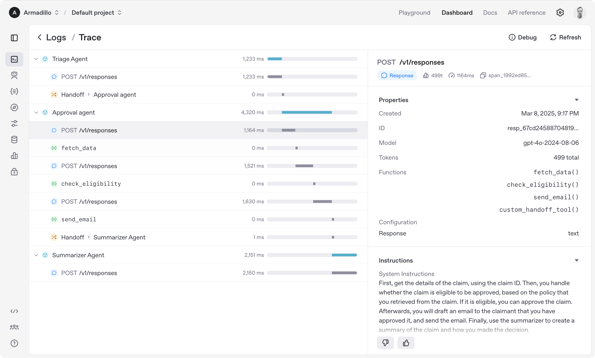

# Agentes: Construyendo Sistemas Inteligentes con OpenAI

## 📋 Tabla de Contenidos
- [Introducción](#introducción)
- [Vista General](#vista-general)
- [Componentes de Agentes](#componentes-de-agentes)
- [Modelos](#modelos)
- [Herramientas](#herramientas)
- [Conocimiento y Memoria](#conocimiento-y-memoria)
- [Guardrails](#guardrails)
- [Orquestación](#orquestación)
- [Agentes de Voz](#agentes-de-voz)
- [Próximos Pasos](#próximos-pasos)

## Introducción

Aprende cómo construir **agents** con la OpenAI API.

Los agentes representan sistemas que logran tareas de manera inteligente, desde ejecutar flujos de trabajo simples hasta perseguir objetivos complejos y abiertos.

OpenAI proporciona un rico conjunto de **primitivas componibles** que te permiten construir agentes. Esta guía recorre esas primitivas y cómo se unen para formar una plataforma agentic robusta.

## Vista General

Construir agentes implica ensamblar componentes a través de varios dominios—como modelos, herramientas, conocimiento y memoria, audio y voz, guardrails, y orquestación—y OpenAI proporciona primitivas componibles para cada uno.

### Dominios de Componentes

| Dominio | Descripción | Primitivas de OpenAI |
|---------|-------------|---------------------|
| **Models** | Inteligencia central capaz de razonar, tomar decisiones y procesar diferentes modalidades | o1, o3-mini, GPT-4.5, GPT-4o, GPT-4o-mini |
| **Tools** | Interfaz con el mundo, interactuar con el entorno, function calling, herramientas integradas, etc. | Function calling, Web search, File search, Computer use |
| **Knowledge and memory** | Aumentar agentes con conocimiento externo y persistente | Vector stores, File search, Embeddings |
| **Audio and speech** | Crear agentes que puedan entender audio y responder en lenguaje natural | Audio generation, realtime, Audio agents |
| **Guardrails** | Prevenir comportamiento irrelevante, dañino o indeseable | Moderation, Instruction hierarchy (Python), Instruction hierarchy (TypeScript) |
| **Orchestration** | Desarrollar, desplegar, monitorear y mejorar agentes | Python Agents SDK, TypeScript Agents SDK, Tracing, Evaluations, Fine-tuning |
| **Voice agents** | Crear agentes que puedan entender audio y responder en lenguaje natural | Realtime API, Voice support en Python Agents SDK, Voice support en TypeScript Agents SDK |

## Componentes de Agentes

### 🧠 Modelos

Los **large language models (LLMs)** están en el centro de muchos sistemas agentic, responsables de tomar decisiones e interactuar con el mundo. Los modelos de OpenAI soportan una amplia gama de capacidades:

#### Fortalezas Agentic por Modelo

| Modelo | Fortalezas Agentic |
|--------|-------------------|
| **o3 y o4-mini** | Mejor para planificación a largo plazo, tareas difíciles y razonamiento |
| **GPT-4.1** | Mejor para ejecución agentic |
| **GPT-4.1-mini** | Buen balance de capacidad agentic y latencia |
| **GPT-4.1-nano** | Mejor para baja latencia |

#### Capacidades Principales

- **Alta inteligencia**: Capaz de razonar y planificar para abordar las tareas más difíciles
- **Tools**: Llama tus funciones y aprovecha las herramientas integradas de OpenAI
- **Multimodalidad**: Entiende nativamente texto, imágenes, audio, código y documentos
- **Baja latencia**: Soporte para conversaciones de audio en tiempo real y modelos más pequeños y rápidos

Para comparaciones detalladas de modelos, visita la [página de modelos](/docs/models).

### 🛠️ Herramientas

Las herramientas permiten a los agentes interactuar con el mundo. OpenAI soporta **function calling** para conectar con tu código, y **built-in tools** para tareas comunes como búsquedas web y recuperación de datos.

#### Tipos de Herramientas

| Herramienta | Descripción |
|-------------|-------------|
| **Function calling** | Interactuar con código definido por el desarrollador |
| **Web search** | Obtener información actualizada de la web |
| **File search** | Realizar búsqueda semántica en tus documentos |
| **Computer use** | Entender y controlar una computadora o navegador |
| **Local shell** | Ejecutar comandos en una máquina local |

### 🧠 Conocimiento y Memoria

El conocimiento y la memoria ayudan a los agentes a almacenar, recuperar y utilizar información más allá de sus datos de entrenamiento inicial. Los **vector stores** permiten a los agentes buscar en tus documentos semánticamente y recuperar información relevante en tiempo de ejecución.

Mientras tanto, los **embeddings** representan datos eficientemente para recuperación rápida, potenciando soluciones de conocimiento dinámico y memoria de agente a largo plazo. Puedes integrar tus datos usando los **vector stores** de OpenAI y la **Embeddings API**.

#### Características Principales

- **Búsqueda semántica** en documentos
- **Recuperación de información** en tiempo real
- **Memoria persistente** para agentes
- **Integración de datos** externos

### 🛡️ Guardrails

Los guardrails aseguran que tus agentes se comporten de manera segura, consistente y dentro de tus límites intencionados—crítico para despliegues en producción. Usa la **Moderation API** gratuita de OpenAI para filtrar automáticamente contenido inseguro.

Controla aún más el comportamiento de tu agente aprovechando la **instruction hierarchy**, que prioriza prompts definidos por desarrolladores y mitiga comportamientos no deseados de agentes.

#### Funcionalidades de Seguridad

- **Filtrado automático** de contenido inseguro
- **Jerarquía de instrucciones** para control de comportamiento
- **Mitigación** de comportamientos no deseados
- **Consistencia** en respuestas

### 🎼 Orquestación

Construir agentes es un proceso. OpenAI proporciona herramientas para construir, desplegar, monitorear, evaluar y mejorar sistemas agentic de manera efectiva.

*Agent Traces UI en el Dashboard de OpenAI*

#### Fases de Desarrollo

| Fase | Descripción | Primitivas de OpenAI |
|------|-------------|---------------------|
| **Build and deploy** | Construir agentes rápidamente, hacer cumplir guardrails y manejar flujos conversacionales usando el Agents SDK | Agents SDK Python, Agents SDK TypeScript |
| **Monitor** | Observar comportamiento del agente en tiempo real, debuggear problemas y obtener insights a través de tracing | Tracing |
| **Evaluate and improve** | Medir rendimiento del agente, identificar áreas de mejora y refinar tus agentes | Evaluations, Fine-tuning |

### 🎤 Agentes de Voz

Crea agentes que puedan entender audio y responder en lenguaje natural. Los agentes de voz combinan capacidades de audio con inteligencia artificial para proporcionar experiencias conversacionales naturales.

#### Características de Agentes de Voz

- **Comprensión de audio** en tiempo real
- **Respuesta en lenguaje natural**
- **Integración con APIs** de voz
- **Soporte multiplataforma**

## Próximos Pasos

### 🚀 Comenzando con Agentes

1. **Elige un modelo** apropiado para tu caso de uso
2. **Define las herramientas** que necesitará tu agente
3. **Configura guardrails** para comportamiento seguro
4. **Implementa orquestación** para monitoreo y mejora

### 📚 Recursos Adicionales

- **[Agents SDK Documentation](/docs/agents)** - Documentación completa del SDK de agentes
- **[Model Comparison](/docs/models)** - Comparación detallada de modelos
- **[Function Calling Guide](/docs/guides/function-calling)** - Guía para function calling
- **[Vector Stores](/docs/guides/embeddings)** - Trabajando con vector stores

### 🛠️ Herramientas de Desarrollo

- **Python Agents SDK** - Para desarrollo en Python
- **TypeScript Agents SDK** - Para desarrollo en TypeScript
- **OpenAI Dashboard** - Para monitoreo y trazabilidad
- **Tracing Tools** - Para debugging y optimización

---

> **Nota**: Los agentes representan el siguiente nivel en la evolución de la inteligencia artificial aplicada. Comienza con casos de uso simples y gradualmente construye sistemas más complejos.

### Casos de Uso Comunes

- **Asistentes virtuales** para atención al cliente
- **Agentes de investigación** para análisis de datos
- **Bots conversacionales** para interacciones naturales
- **Sistemas de automatización** para tareas complejas
- **Agentes de análisis** para insights de negocio

---

*Esta guía se actualiza regularmente con las mejores prácticas emergentes en el desarrollo de agentes.*
